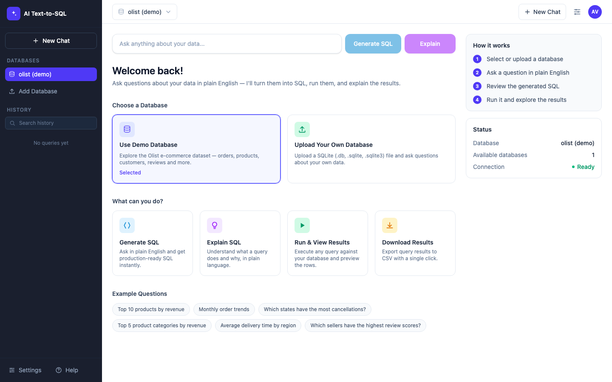
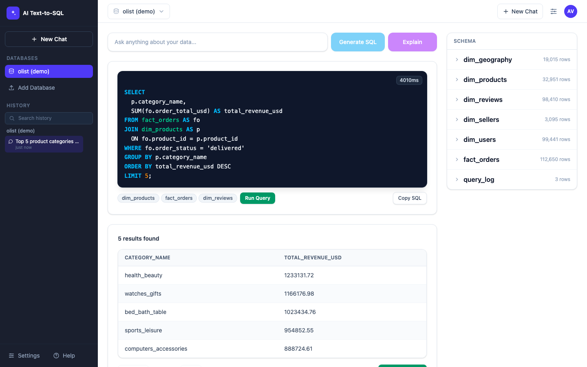
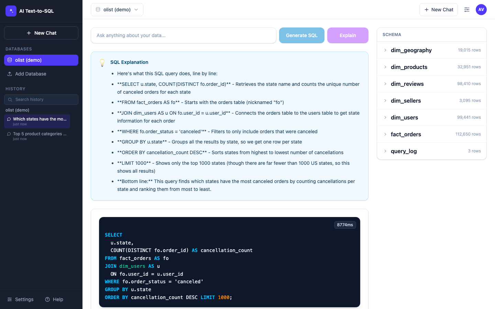

# AI Text-to-SQL

Ask questions about your data in plain English — get production-ready SQL,
live results, and a plain-language explanation in seconds.

AI Text-to-SQL pairs a Claude-powered generation pipeline with a retrieval-augmented
semantic layer, a human-in-the-loop safety guard, and a polished analytics-style UI
on top of a real e-commerce dataset (Olist, 100k+ orders).

## Screenshots

### Welcome screen
Pick a database, browse example questions, and get oriented with the "How it works" panel.



### Generated SQL & results
Claude generates the SQL, highlights the tables it used, and lets you run it to view results inline.



### Explain mode
Get a plain-English, line-by-line breakdown of any generated query.



## Features

- **Natural language → SQL** — Claude (Anthropic) turns plain English questions into SQLite queries.
- **Retrieval-augmented schema context (RAG)** — ChromaDB + sentence-transformers retrieve only the
  table/column descriptions relevant to a question, keeping prompts small and accurate.
- **Semantic layer / data dictionary** — business definitions for tables, columns, and metrics
  (e.g. GMV, unique orders) guide the model toward correct joins and aggregations.
- **Few-shot examples** — curated question/SQL pairs improve generation quality and consistency.
- **Human-in-the-loop safety guard** — blocks `INSERT`/`UPDATE`/`DELETE`/`DROP`/`ALTER`/etc. and
  requires explicit confirmation before any flagged query can run; automatically injects a
  `LIMIT` to cap result sizes.
- **Explain mode** — get a bullet-point, plain-English walkthrough of what a generated query does.
- **Run Query** — execute the generated SQL directly and preview results without leaving the page.
- **Results table** — paginated, sortable-friendly table with one-click **CSV export**.
- **Multi-database support** — use the bundled Olist demo database or upload your own
  `.db` / `.sqlite` / `.sqlite3` file and query it the same way.
- **Schema Explorer** — accordion view of every table with row counts, column names, and types.
- **Query history** — searchable, per-database history (rename or delete sessions), stored locally
  in the browser.
- **Query audit log** — every generated query, its SQL, latency, and metadata are logged to a
  `query_log` table for observability.
- **Modern SaaS-style UI** — dark sidebar navigation, top navbar with database switcher, and a
  guided welcome screen with example questions.

## Tech Stack

**Backend**
- [Python 3.12](https://www.python.org/) + [FastAPI](https://fastapi.tiangolo.com/) + [Uvicorn](https://www.uvicorn.org/)
- [Anthropic Claude API](https://www.anthropic.com/) (`claude-sonnet-4-5`) for SQL generation & explanations
- [SQLAlchemy](https://www.sqlalchemy.org/) + [SQLite](https://www.sqlite.org/) for the data layer
- [ChromaDB](https://www.trychroma.com/) + [sentence-transformers](https://www.sbert.net/) (`all-MiniLM-L6-v2`) for RAG-based schema retrieval
- [Pandas](https://pandas.pydata.org/) for data loading/transformation, [PyYAML](https://pyyaml.org/) for few-shot examples

**Frontend**
- [React 19](https://react.dev/) + [TypeScript](https://www.typescriptlang.org/)
- [Vite](https://vite.dev/) for tooling/dev server
- [Tailwind CSS v4](https://tailwindcss.com/) for styling

**Data**
- [Brazilian E-Commerce Public Dataset by Olist](https://www.kaggle.com/datasets/olistbr/brazilian-ecommerce) (~100k orders)

## Project Structure

```
.
├── agent/                  # Text-to-SQL pipeline
│   ├── sql_chain.py        # Orchestration: retrieval → generation → safety → execution → logging
│   ├── semantic_layer.py   # Table/column business definitions for the LLM
│   ├── retriever.py        # ChromaDB-backed schema retrieval (RAG)
│   ├── build_index.py       # Builds the ChromaDB index from the semantic layer
│   ├── hitl_guard.py        # Human-in-the-loop safety checks + LIMIT injection
│   └── few_shot_examples.yaml
├── api/                    # FastAPI app
│   ├── main.py
│   └── routes/             # query, schema, health endpoints
├── model/                  # SQLAlchemy models (star schema + query_log) and DB session
├── data/
│   ├── seed.py             # Loads Olist CSVs into data/olist.db
│   ├── raw/                # Raw Olist CSVs (not committed)
│   └── olist.db            # SQLite database (not committed)
├── frontend/               # React + TypeScript + Vite app
│   └── src/
│       ├── App.tsx
│       ├── components/     # Sidebar, TopNavbar, WelcomeScreen, SqlDisplay, ResultsTable, etc.
│       └── lib/
└── requirements.txt
```

## Getting Started

### Prerequisites

- Python 3.12+
- Node.js 18+ and npm
- An [Anthropic API key](https://console.anthropic.com/)
- The [Olist Brazilian E-Commerce dataset](https://www.kaggle.com/datasets/olistbr/brazilian-ecommerce) CSVs

### 1. Clone the repository

```bash
git clone <repository-url>
cd text-to-sql
```

### 2. Backend setup

Create a virtual environment and install dependencies:

```bash
python3 -m venv venv
source venv/bin/activate
pip install -r requirements.txt
```

Copy the example environment file and fill in your Anthropic API key:

```bash
cp .env.example .env
```

```dotenv
ANTHROPIC_API_KEY=your_actual_key_here
DATABASE_URL=sqlite:///./data/olist.db
CHROMA_STORE_PATH=./chroma_store
FRONTEND_URL=http://localhost:3000
```

### 3. Add the dataset

Download the [Olist dataset](https://www.kaggle.com/datasets/olistbr/brazilian-ecommerce) and place
the CSV files under `data/raw/archive/` (or `data/raw/`), including:

```
olist_customers_dataset.csv
olist_orders_dataset.csv
olist_order_items_dataset.csv
olist_order_reviews_dataset.csv
olist_products_dataset.csv
olist_sellers_dataset.csv
olist_geolocation_dataset.csv
product_category_name_translation.csv
```

### 4. Seed the database

This builds the star schema (`dim_users`, `dim_products`, `dim_sellers`, `dim_geography`,
`dim_reviews`, `fact_orders`) plus the `query_log` audit table in `data/olist.db`:

```bash
python data/seed.py
```

### 5. Build the RAG index

Indexes the semantic layer's table/column descriptions into ChromaDB so the agent can retrieve
relevant schema context per question:

```bash
python -m agent.build_index
```

### 6. Run the backend

```bash
uvicorn api.main:app --reload
```

The API will be available at `http://localhost:8000` (interactive docs at `/docs`).

### 7. Frontend setup

In a separate terminal:

```bash
cd frontend
npm install
npm run dev
```

Open **http://localhost:5173** — the Vite dev server proxies `/api` requests to the backend on
port 8000.

## Usage

1. **Choose a database** — start with the bundled Olist demo, or upload your own SQLite file from
   the sidebar or welcome screen.
2. **Ask a question** — type in plain English (or click an example question chip) and click
   **Generate SQL**.
3. **Review the SQL** — the syntax-highlighted query and referenced tables are shown immediately.
4. **Run it** — click **Run Query** to execute and view paginated results, or **Download CSV** to export.
5. **Explain it** — click **Explain** instead to get a plain-English breakdown of what the query does.
6. **Browse history** — past questions are grouped per database in the sidebar, with search,
   rename, and delete.
7. **Explore the schema** — expand tables in the Schema panel to see columns, types, and row counts.

## Safety Guardrails

Every generated query passes through a human-in-the-loop guard before execution:

- Queries containing `INSERT`, `UPDATE`, `DELETE`, `DROP`, `CREATE`, `ALTER`, `TRUNCATE`, or `EXEC`
  are flagged and require explicit user confirmation before running.
- A `LIMIT` clause is automatically injected on `SELECT` queries to cap result set size.
- Every generated query (question, SQL, tables used, latency, and whether explain was requested)
  is recorded in the `query_log` table for auditability.

## API Reference

| Method | Endpoint                              | Description                                      |
| ------ | -------------------------------------- | ------------------------------------------------ |
| GET    | `/api/health`                          | Health check                                      |
| POST   | `/api/query`                           | Generate SQL (and optionally an explanation) from a natural language question |
| POST   | `/api/query/execute`                   | Execute a SQL statement against a database        |
| GET    | `/api/query/export-csv`                | Export the latest results for a question as CSV   |
| GET    | `/api/database/list`                   | List available databases                          |
| POST   | `/api/database/upload`                 | Upload a new SQLite database                       |
| GET    | `/api/database/schema/{encoded_path}`  | Get tables, columns, types, and row counts for a database |
| GET    | `/api/schema`                          | Legacy schema endpoint                             |

## Acknowledgments

- [Olist Brazilian E-Commerce Public Dataset](https://www.kaggle.com/datasets/olistbr/brazilian-ecommerce)
- [Anthropic Claude](https://www.anthropic.com/)
